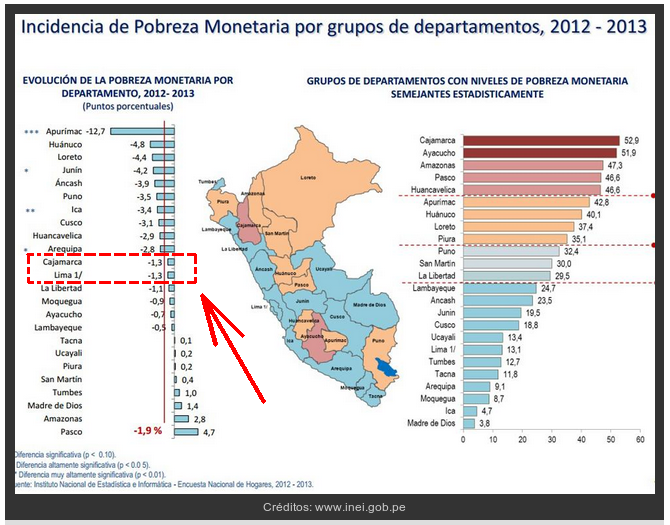
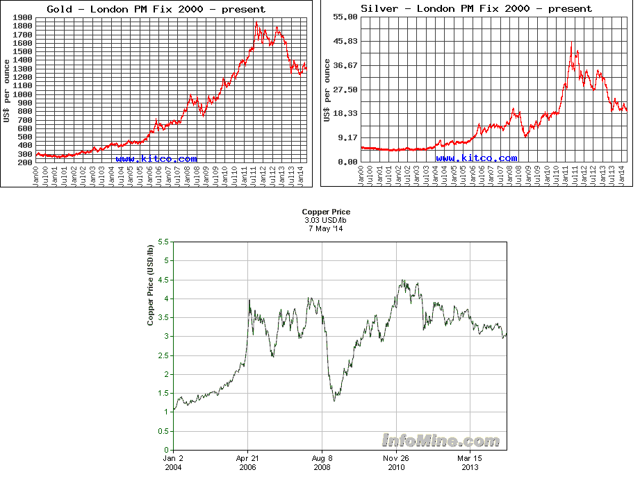
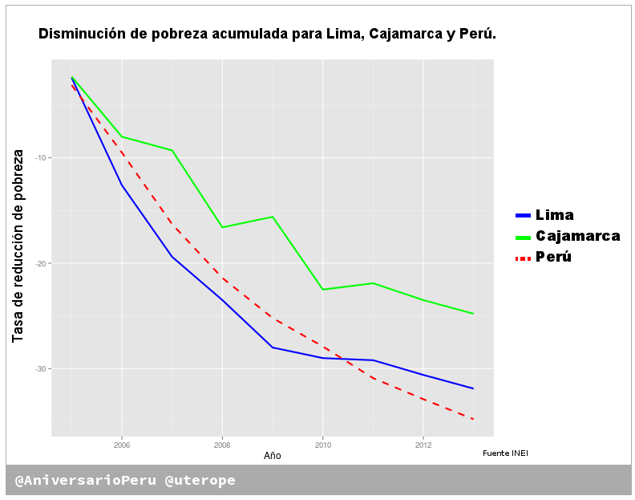

# Siete refutaciones a la columna de Aldo Mariátegui

En posts anteriores hemos discutido que una lectura equivocada de datos
estadísticos puede causar interpretaciones erróneas de la realidad de las
cosas.

Todos nos equivocamos. Equivocarse no es pecado porque hasta 
[Bill Gates se equivocó](http://aniversarioperu.utero.pe/2014/05/04/oie-bill-gates-los-mosquitos-no-son-tan-asesinos-como-crees/).

Hace unos días, el INEI publicó un informe técnico donde informan
los niveles de pobreza por cada región para el 2013. 
Los datos del INEI revelan que Cajamarca es la región con mayor pobreza,
alcanzando un 52%.
Además incluyen datos
estadísticos sobre el aumento o disminución de pobreza comparando con años
anteriores al 2013. 

Columnas y notas de prensa
([elcomercio.pe](http://elcomercio.pe/peru/cajamarca/lamentan-altas-cifras-pobreza-cajamarca-noticia-1727020),
 [RPP](http://www.rpp.com.pe/2014-05-05-aseguran-que-modelo-economico-de-santos-afecto-a-cajamarca-noticia_689692.html),
 [Andina](http://www.andina.com.pe/agencia/noticia-primer-lugar-cajamarca-pobreza-es-responsabilidad-santos-afirman-504662.aspx#.U2kpvnV53oM),
[Correo](http://diariocorreo.pe/ultimas/noticias/9368245/tema-del-dia/santos-tiene-a-cajamarca-con-mas-de-50-de-p)
y [Peru21](http://peru21.pe/impresa/izquierda-esa-buena-2181807))
 que discuten los datos del INEI, y/o recogen opinión de entendidos en
 el tema, concuerdan en una
cosa: 

> **Gregorio Santos y paralización de Conga tienen la culpa que
Cajamarca sea la región más pobre del Perú**.

Lamentablemente hemos (nosotros 3 blogueros del útero de marita) encontrado que **algunos han interpretado mal los datos**
del INEI.
Creemos que no tiene fundamento opinar que Cajamarca está estancada y es la
región más pobre debido al fallido proyecto minero Conga.

Normalmente pasaríamos este tema por alto pero ha rebotado en todos lados y
hemos leído texto que **nos han dejado indignado, sobre todo en la [columna de
Aldo Mariátegui](http://peru21.pe/impresa/izquierda-esa-buena-2181807)**.

Podemos hacer una comparación odiosa y ver el desempeño de la región Cajamarca
en comparación con la región Lima (la cual se supone que mueve la economía del
país ya que tiene el puerto más importante, el centro financiero, etc).
Los datos nos dicen que en el 2004 Lima tenía 45% de pobres y Cajamarca
tenía 77% (y era una de las regiones de mayor pobreza). Es de esperarse
que conforme pase el tiempo las dos
regiones reduzcan su pobreza, pero es sensato esperar que luego de 10
años Cajamarca haya dejado de ser una de las regiones más pobres?

En este útero argumentamos que no es sensato hacer una comparación de
porcentajes totales de pobreza entre regiones. **Creemos que se debe comparar la
tasa de cambio de pobreza en el tiempo**. O sea hay que comparar la velocidad a
la que la pobreza se reduce en cada región, ver la que haya reducido su pobreza
más lento y apuntar el dedo acusando a sus autoridades de ineficientes.

Haciendo una analogía con una carrera de rally, podemos suponer que tenemos dos
competidores, el auto representante de la región Cajamarca y el auto
representante de la Región Lima. Como en todo rally, los autos no parten al
mismo tiempo, primero parte uno, y luego de un buen rato parte el otro. En esta
carrera de rally, llegar a la meta (o sea 0% de pobreza) no es lo importante ya
que los dos autos llegan. Lo importante es saber qué auto llega a la meta más
rápido.

En esta analogía, el auto de la región Lima partió antes que la región Cajamarca
y cuando se hizo la medición de las posiciones en el año 2004 se vio que a Lima
le faltaba recorrer el 45% del trayecto mientras que a Cajamarca le faltaba
recorrer el 77% (45% de pobreza versus 77% en el año 2004).
Si paramos la carrera en el año 2014 se debe esperar lo mismo, que Lima siga a
la delantera y que Cajamarca siga en el grupo de los rezagados (13% de pobreza
versus 52%).

Para saber qué auto va ganando hay que medir su velocidad, en nuestro caso será
la tasa de reducción de pobreza. No es correcto decir que Cajamarca es un auto
muy lento, o se ha quedado parado solo por el hecho de venir detrás del auto de
Lima. Posiciones absolutas no cuentan.

# Es mejor comparar tasas de reducción de la pobreza
[El gráfico que sale](http://www.rpp.com.pe/2014-05-02-inei-la-pobreza-se-incremento-en-ocho-regiones-del-peru-en-el-2013-noticia_689046.html)
en la web de RPP está bien claro. Se observa que **la administración económica de
Cajamarca es tan eficiente como la de Lima** ya que **las dos regiones han reducido
su pobreza en el mismo porcentaje 1.3%**.

Si vamos a hacer el ejercicio simplista de echar la culpa de la pobreza a las
autoridades **podemos decir entonces que el desempeño de Gregorio Santos es tan
bueno como el de la autoridad económica en la región Lima**
(habla Miguel Castilla), ya que ambos son responsables de haber reducido
la pobreza en un 1.3%.

En nuestra analogía de rally, durante los años 2012 y 2013, **los autos de Lima y
Cajamarca han avanzado a la misma velocidad. Sus pilotos tienen la misma
destreza a pesar que uno vaya adelante del otro**.

# Refutando a Aldo Mariátegui
Vamos a tomar la columna que nos ha indignado más para refutar punto por punto.
Aquí pueden leer el texto completo
<http://peru21.pe/impresa/izquierda-esa-buena-2181807>.

# 1. "[Cajamarca] es la única [región] del país que viene experimentando una
recesión desde hace años, mientras el resto del país crecía"
Es curioso que Cajamarca tenga recesión desde hace años y aún así haya sido capaz
de disminuir su pobreza.

# 2. "todo esto es culpa exclusiva del presidente regional Gregorio Santos,
el cura Arana..."
Si todo es culpa de Gregorio Santos, debemos felicitarlo por tener el mismo
desempeño en política económica que las autoridades económicas de Lima ya que
las dos regiones redujeron su pobreza en 1.3%.

# 3. "todo esto es culpa de ... y un grupete más de rojos nocivos"
En discusiones serias se atacan las ideas y no a las personas. Adjetivos que
buscan ofender como **grupete de rojos nocivos** son argumentos [*ad hominen*
del tipo abusivo](http://es.wikipedia.org/wiki/Argumento_ad_hominem)
que deben ser evitados en discusiones serias.

# 4. "gran parte del enfriamiento económico que venimos sintiendo en el
país proviene de allí, pues Conga significó el frenazo a la inversión minera y
a la confianza empresarial"
Todo lo contrario. La presidenta de la Sociedad Nacional de Minería, Petróleo y
Energía, Eva Arias, dice que "A pesar de que el sector minero peruano viene
siendo afectado por la caída de los precios internacionales de los minerales,
       el ritmo de las inversiones hacia este sector productivo se mantiene
       porque los inversionistas han depositado su confianza en el Perú" (ver
       nota aquí: [El Comercio](http://elcomercio.pe/economia/peru/mineria-represento-21-inversion-privada-desde-2011-noticia-1727283)).
La inversión minera no ha sufrido frenazo, al contrario han pisado el
acelerador. Inversión minera por años según presidenta de la Soc. Nacional de
Minería:
* Año 2011: 7.2 mil millones de dólares.
* Año 2012: 8.5 mil millones de dólares.
* Año 2013: 9.7 mil millones de dólares.

Haríamos mal en culpar a Conga de haber causado un aumento de la inversión
minera en el Perú. Y peor aún es afirmar que Conga ha causado disminución de la
inversión ya que las cifras dicen lo contrario.

# 5. "acuérdate de Conga y de la izquierda cuando veas que tus negocios no
van como antes, que ya no hay tanto trabajo disponible"
Al contrario, según datos del INEI y el bonito 
[gráfico de
RPP](http://www.rpp.com.pe/2014-05-02-inei-la-pobreza-se-incremento-en-ocho-regiones-del-peru-en-el-2013-noticia_689046.html)
vemos que la pobreza en el Perú ha disminuido en 1.9% durante entre 2012 y
2013. Si hay menos pobres deber ser que han tenido mayor trabajo.
El INEI dice que **el empleo en el Perú lleva 51 meses de incremento continuo**
(información a febrero de este año). Mira la nota aquí en
[El
Comercio](http://elcomercio.pe/economia/peru/empleo-seguira-desacelerandose-lo-que-resta-ano-noticia-1726656).

# 6. "hay déficit comercial y sube el dólar porque se exporta menos volumen
de metales"
Los precios de los metales en el mercado internacional siempre han sido
cíclicos y lamentablemente estamos en un año donde hay caída en el precio y
caída en la demanda. Este año es un **bear market** para los metales. Aquí
están cuadros de precios históricos de los metales. Es evidente que no estamos
en un buen año. Si afirmamos que este mal año es por culpa de Gregorio Santos y 
Conga, también habría que afirmar que ellos tienen la culpa del desplome del
precio en décadas pasadas. Los gráficos dicen que los precios internacionales
fueron espectaculares durante el 2011 y de allí han comenzado a caer
a paso firme (oro, plata y cobre).

# 7. "la izquierda no es más que atraso (Velasco, Santos, Villarán, Arana)
y violencia (Sendero Luminoso, MRTA)".
No es bueno tales generalizaciones y estereotipos. También podemos estereotipar
de la siguiente manera:

* **La izquierda es buena y solo significa progreso**. Por ejemplo Suecia tuvo entre
  1996 y 2006 a Göran Persson como primer ministro, quien es miembro del
  **partido Social Democrático**. Este es el partido socialista, el cual 
  "tiene como base teórica una revisión del **Marxismo**" 
  ([fuente Wikipedia](http://en.wikipedia.org/wiki/Swedish_Social_Democratic_Party)).
  A pesar de estar gobernado por el partido de izquierda por 10 años, Suecia no
  cayó en el atraso, al contrario.

# Para concluir
Fue en el año 2011 cuando el problema de Conga reventó,
Gregorio Santos se hizo famoso y cayeron los dos gabinetes de Ollanta Humala,
         los mineros se espantaron, Cajamarca entró en recesión etc. 
Entonces por qué vemos que la reducción de la pobreza entre Lima y Cajamarca
tiene la misma velocidad (misma pendiente) entre los años 2011 y 2013? Y porqué
se ve una ligera aceleración en la reducción de la pobreza a nivel de todo el
Perú?

Los datos y código para generar el gráfico están en <a href="https://github.com/aniversarioperu/pobreza">mi cuenta github</a>.
